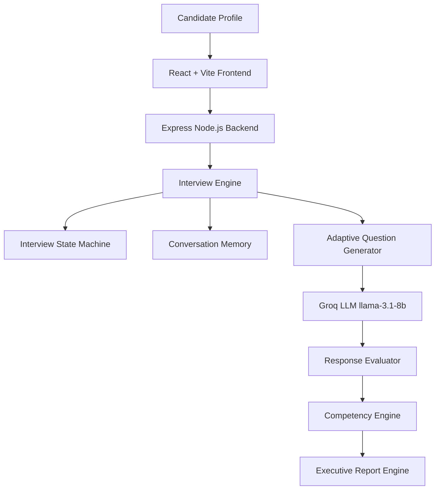

# InterviewOS — Autonomous Adaptive AI Technical Interview Platform

> **"Build the interviewer, not the interview."** — Hackathon Edition

InterviewOS is an autonomous, adaptive AI Technical Interviewer engineered for evaluating candidate capabilities across a **31-Day AI Engineering Cohort**. Built to emulate senior principal interviewers at Companies like Google, Meta, and OpenAI, InterviewOS combines deterministic finite state machines, multi-turn conversation memory, runtime assertion guards, 1–5 competency scoring, and executive hiring panel evaluation reports.

---

## 🏗️ Technical System Architecture

The full technical implementation pipeline is designed for scalability, zero prompt leakage, and strict state machine-driven interview turns.



### Architecture Component Breakdown
- **React + Vite Frontend**: High-performance 60fps dark obsidian UI built with Tailwind/Glassmorphism CSS, Lucide icons, and Framer Motion microinteractions.
- **Express Node.js Backend**: REST API orchestrator handling session memory and stateful turn execution (`POST /api/interview`, `GET /api/candidates`, `GET /health`).
- **Interview State Machine**: 10-state finite state machine (`GREETING`, `PLANNING`, `QUESTION`, `LISTENING`, `EVALUATING`, `FOLLOW_UP`, `HINT`, `TOPIC_SWITCH`, `FINAL_EVALUATION`, `COMPLETED`).
- **Adaptive Question Generator**: Synthesizes grounded interviewer prompts enforcing 4 runtime assertion guards (curriculum topic grounding, no topic leakage, prompt diversity across last 3 turns, follow-up phrase guard).
- **Conversation Memory**: Stateful memory tracking visited days, asked objectives, candidate answer history, detected mistakes, strengths, and weaknesses.
- **Competency Engine**: Calculates evidence-weighted 1–5 scale scores across Technical Understanding, Practical Implementation, Architecture, Trade-offs, and Communication.
- **Executive Report Engine**: Compiles evidence-backed hiring panel decisions, 5-star topic evaluation grids, verified strengths, specific missing concepts, and weak-area growth roadmaps.

---

## 💡 Interview Intelligence Flow

How InterviewOS reasons through a complete technical interview:

1. **Candidate Profile**: Evaluates background and seniority ($S \in [1.0, 5.0]$).
2. **Curriculum Analysis**: Inspects completed and skipped missions across the 31-Day AI Cohort.
3. **Adaptive Interview Planning**: Constructs deterministic day target plans prioritizing candidate weak areas.
4. **Live Technical Interview**: Conducts multi-turn dialogue with real-time cockpit meters.
5. **Conversation Memory**: Remembers previous turns, mistakes, and demonstrated concepts.
6. **Dynamic Follow-up Reasoning**: Applies progressive probing on good answers (`basic` → `implementation` → `trade-offs`).
7. **Evidence Collection**: Verifies technical concept proofs without inventing false strengths.
8. **Competency Evaluation**: Scores 5 core dimensions on a 1–5 scale.
9. **Executive Hiring Recommendation**: Delivers hiring panel decisions and actionable growth roadmaps.

---

## 🌟 Key Differentiators & Features

1. **Adaptive Reasoning**: Generates intelligent follow-up questions based on previous answers.
2. **Curriculum Awareness**: Grounds every interview in the candidate's completed AI Cohort journey.
3. **Multi-turn Memory**: Maintains interview context, remembers strengths, mistakes, and previous answers.
4. **Evidence-Based Evaluation**: Hiring decisions are generated from accumulated interview evidence rather than isolated responses.
5. **Executive Hiring Report**: Produces 1-5 competency scores, evidence-backed strengths, focused learning roadmap, and hiring recommendation.

---

## 🛠️ Tech Stack

- **Frontend**: React 19, Vite, TypeScript, Framer Motion, Lucide React, Glassmorphism CSS
- **Backend**: Node.js, Express, TypeScript, Groq SDK (`llama-3.1-8b-instant`)
- **State Engine**: Finite State Machine, Conversation Memory, Curriculum Navigator

---

## 🚀 Quick Start Guide

### Prerequisites
- **Node.js**: v18+ & `npm`

### 1. Start Backend API Server
```bash
cd backend
npm install
npm run build
npm start
```
*Backend server runs on `http://localhost:5001`*

### 2. Start Frontend Cockpit
```bash
cd frontend
npm install
npm run dev
```
*Frontend application runs on `http://localhost:5173`*

---

## 🧪 Running Automated Test Suites

```bash
cd backend

# Test Candidate & Curriculum Dataset Loaders
npm run test:phase1

# Test Express Server, Health & Session Store
npm run test:phase2

# Test Deterministic Brain Components
npm run test:brain

# Test Orchestrator & Turn Execution
npm run test:orchestrator

# Full End-to-End Multi-Turn Interview & Structured Feedback
npm run test:e2e
```

---

## 🎯 Hackathon Presentation Demo Flow

1. **Landing Overview**: Present the Hero section, Animated Interview Journey Timeline, Interview Intelligence Flow, and Core AI Capabilities.
2. **Select Candidate**: Open the Candidate Selector Drawer and pick any of the 20 cohort profiles.
3. **Live Interview Session**:
   - Candidate submits technical answers in the floating composer.
   - Observe live cockpit metrics (Questions progress, Days progress, Difficulty meter, State indicator).
   - Observe progressive probing on good answers (`basic` → `implementation` → `trade-offs`).
4. **Executive Hiring Panel Report**: Complete the interview and inspect the 1–5 competency scorecard, 5-star topic ratings, evidence-backed strengths, specific gaps, and panel decision.
