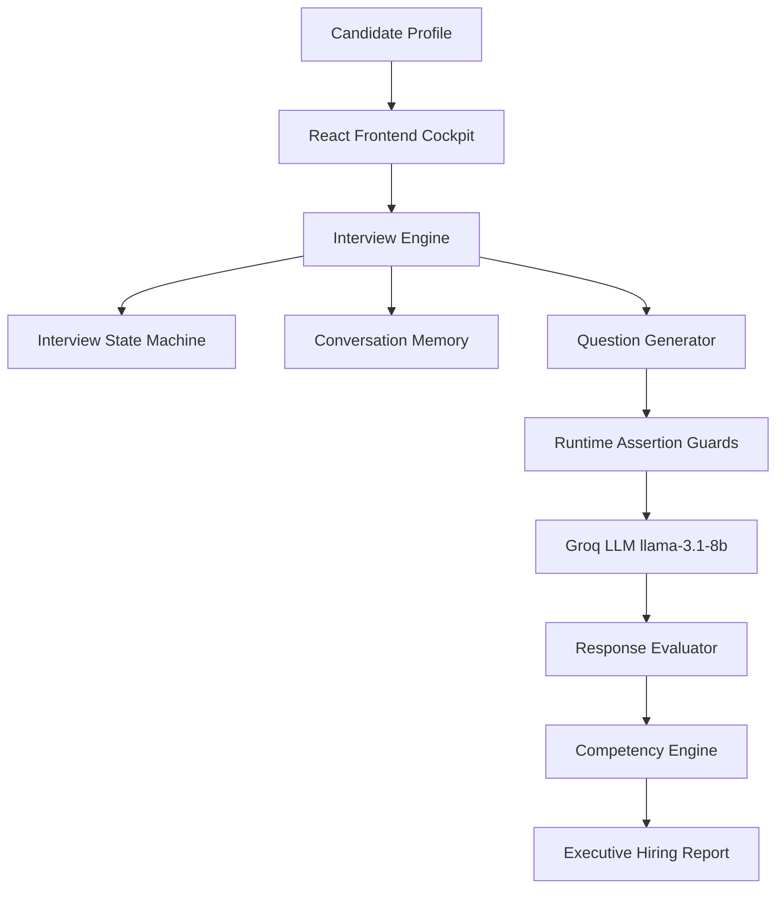

# InterviewOS — Autonomous Adaptive AI Technical Interview Platform

> **"Build the interviewer, not the interview."** — Hackathon Edition

InterviewOS is an autonomous, adaptive AI Technical Interviewer engineered for evaluating candidate capabilities across a **31-Day AI Engineering Cohort**. Built to emulate senior principal interviewers at Companies like Google, Meta, and OpenAI, InterviewOS combines deterministic finite state machines, multi-turn conversation memory, runtime assertion guards, 1–5 competency scoring, and executive hiring panel evaluation reports.

---

## 🚀 Problem & Solution

### The Problem
Traditional technical interviews suffer from high human interviewer variance, superficial keyword-matching automated bots, rigid static question banks, and uninformative pass/fail reports that fail to measure actual engineering competency.

### The Solution: InterviewOS
- **Adaptive State Machine Brain**: Dynamically transitions across 10 interview states (`GREETING`, `LISTENING`, `EVALUATING`, `FOLLOW_UP`, `TOPIC_SWITCH`, `FINAL_EVALUATION`, `COMPLETED`).
- **Progressive Probing**: When a candidate answers correctly, the engine probes implementation details (`basic` → `implementation` → `trade-offs`) for 1 turn before moving to the next topic.
- **Evidence-Based Competency Scoring**: Evaluates candidates on a 1–5 scale across 5 core dimensions:
  1. *Technical Understanding*
  2. *Practical Implementation*
  3. *System Design / Architecture*
  4. *Trade-off Analysis*
  5. *Communication Quality*
- **Executive Hiring Panel Reports**: Generates evidence-backed hiring reports with 5-star topic ratings, session statistics, and hiring panel decisions.

---

## 🏗️ System Architecture



### Architecture Pipeline Breakdown
1. **Candidate Profile**: Evaluates candidate seniority ($S \in [1.0, 5.0]$) and classifies completed/skipped missions.
2. **React Frontend Cockpit**: Built with React, Vite, TypeScript, Tailwind/Glassmorphism CSS, and Framer Motion.
3. **Interview Engine**: Core orchestrator coordinating turn execution without hardcoded prompt leakage.
4. **Conversation Memory**: Stateful memory tracking visited days, asked objectives, turn histories, detected mistakes, strengths, and weaknesses.
5. **Question Generator & Assertion Guards**: Enforces 4 runtime assertions (topic grounding, no topic leakage, prompt diversity across last 3 turns, follow-up phrase guard).
6. **Groq LLM Inference**: High-speed inference using `llama-3.1-8b-instant` with automatic retry logic.
7. **Response Evaluator**: Dual-engine evaluator (Fast-path regex + LLM) classifying responses into 9 buckets (`EXCELLENT`, `GOOD`, `WEAK`, `UNCERTAIN`, `GIBBERISH`, `OFF_TOPIC`, `PROFANITY`, `REFUSAL`, `LACK_OF_EXPERIENCE`).
8. **Competency Engine & Hiring Report**: Calculates 1–5 scale competency scores, topic-level 5-star ratings, and evidence-backed hiring panel decisions.

---

## 🌟 Key Differentiators & Features

1. **Deterministic Interview Brain**:
   - **CandidateAnalyzer**: Scores candidate seniority and mission progress.
   - **InterviewPlanner**: Guarantees coverage across at least 4 curriculum days and minimum 8 questions.
   - **ResponseEvaluator**: Classifies responses deterministically.

2. **Executive Hiring Panel Dashboard**:
   - Overall Star Rating (`★★★★★`)
   - Hiring Panel Decision Breakdown (Technical, Architecture, Communication, Overall)
   - 1–5 Competency Scorecard
   - Session Interview Statistics
   - Evidence-Backed Strengths (max 3) & Specific Missing Concepts (max 5)
   - Focused Growth Roadmap (max 3 weak-area items)

3. **High-Tech SaaS UI (OpenAI × Linear × Apple Quality)**:
   - Dark obsidian background (`#050816`) with low-opacity animated gradient mesh.
   - 60fps Framer Motion microinteractions and transitions.
   - Interactive Candidate Profile Selector Drawer.
   - Real-time cockpit tracking difficulty meters, question progress, and FSM state indicators.

---

## 🛠️ Tech Stack

- **Frontend**: React 19, Vite, TypeScript, Framer Motion, Lucide React, Glassmorphism CSS
- **Backend**: Node.js, Express, TypeScript, Groq SDK (`llama-3.1-8b-instant`)
- **State Engine**: Finite State Machine, Conversation Memory, Curriculum Navigator

---

## 🚀 Quick Start Guide

### Prerequisites
- **Node.js**: v18+ & `npm`

### 1. Start Backend API Server
```bash
cd backend
npm install
npm run build
npm start
```
*Backend server runs on `http://localhost:5001`*

### 2. Start Frontend Cockpit
```bash
cd frontend
npm install
npm run dev
```
*Frontend application runs on `http://localhost:5173`*

---

## 🧪 Running Automated Test Suites

```bash
cd backend

# Test Candidate & Curriculum Dataset Loaders
npm run test:phase1

# Test Express Server, Health & Session Store
npm run test:phase2

# Test Deterministic Brain Components
npm run test:brain

# Test Orchestrator & Turn Execution
npm run test:orchestrator

# Full End-to-End Multi-Turn Interview & Structured Feedback
npm run test:e2e
```

---

## 🎯 Hackathon Presentation Demo Flow

1. **Landing Overview**: Present the Hero section, Animated Interview Journey Timeline (`Greeting` → `Questions` → `Probing` → `Analysis` → `Decision`), and Architecture section.
2. **Select Candidate**: Open the Candidate Selector Drawer and pick any of the 20 cohort profiles.
3. **Live Interview Session**:
   - Candidate submits technical answers in the floating composer.
   - Observe live cockpit metrics (Questions progress, Days progress, Difficulty meter, State indicator).
   - Observe progressive probing on good answers (`basic` → `implementation` → `trade-offs`).
4. **Executive Hiring Panel Report**: Complete the interview and inspect the 1–5 competency scorecard, 5-star topic ratings, evidence-backed strengths, specific gaps, and panel decision.
