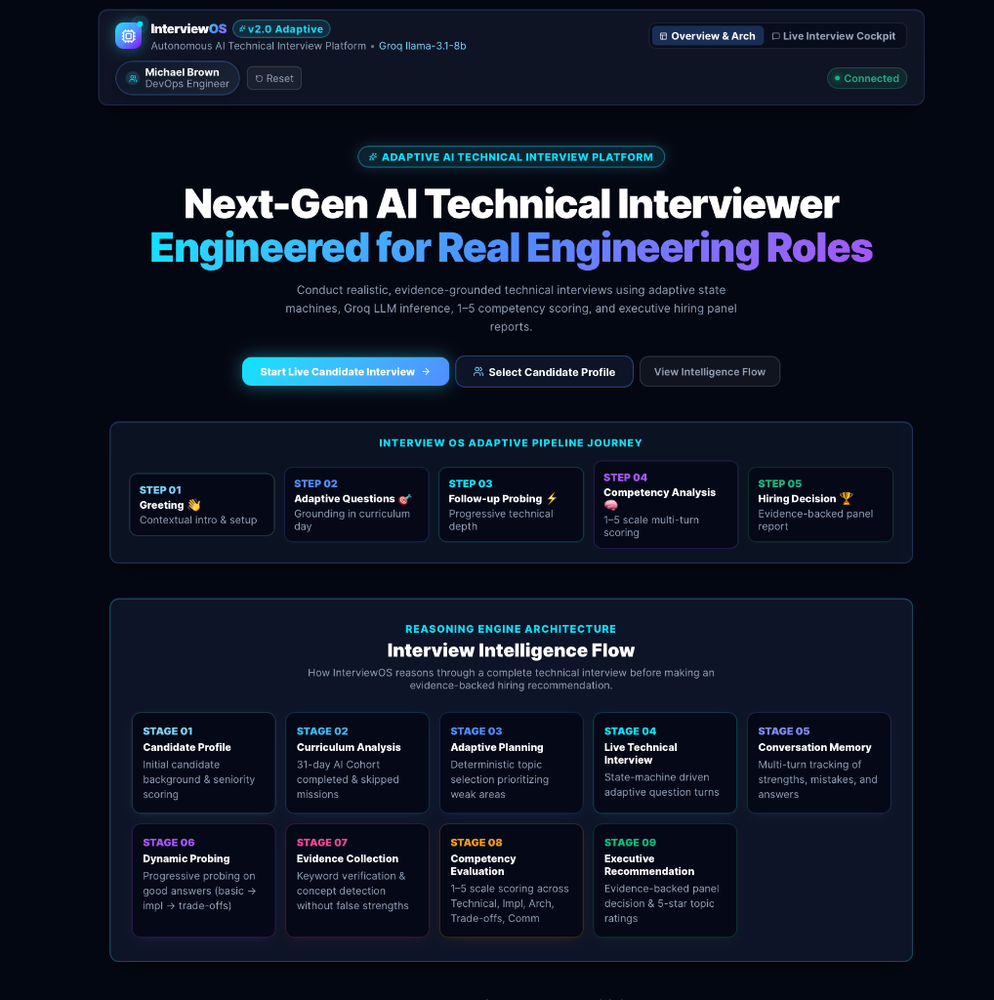
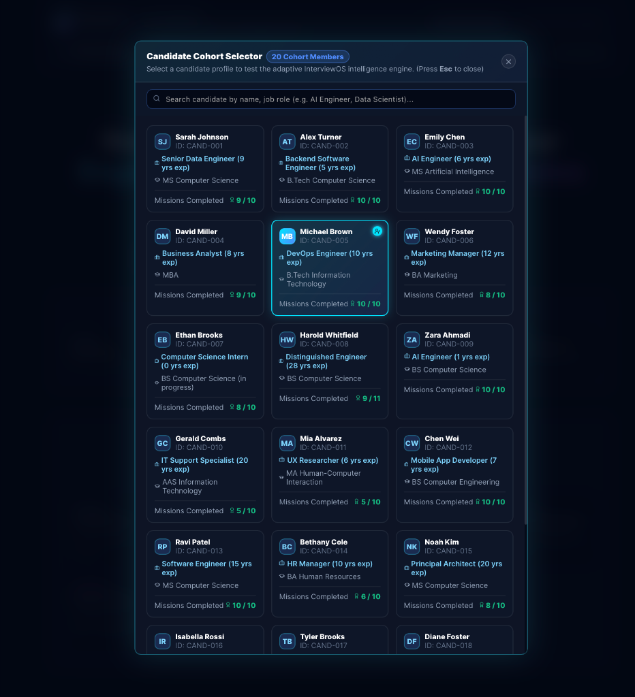
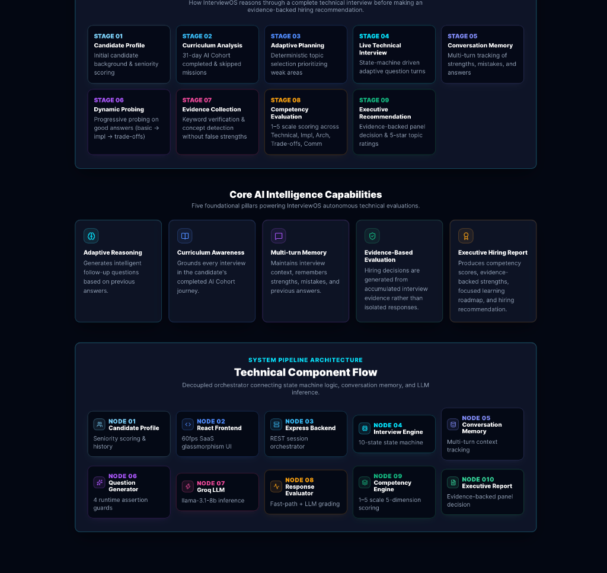
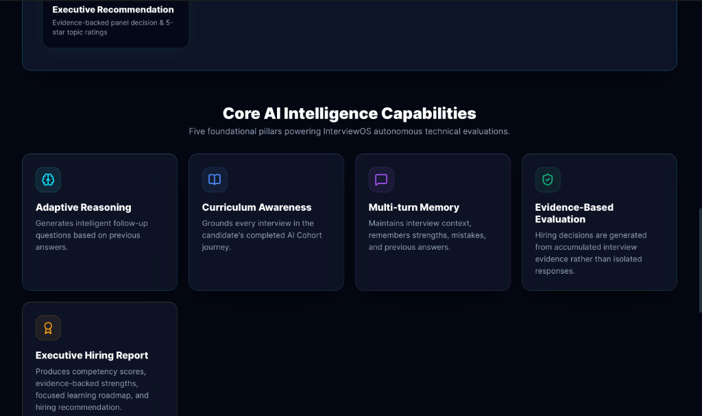
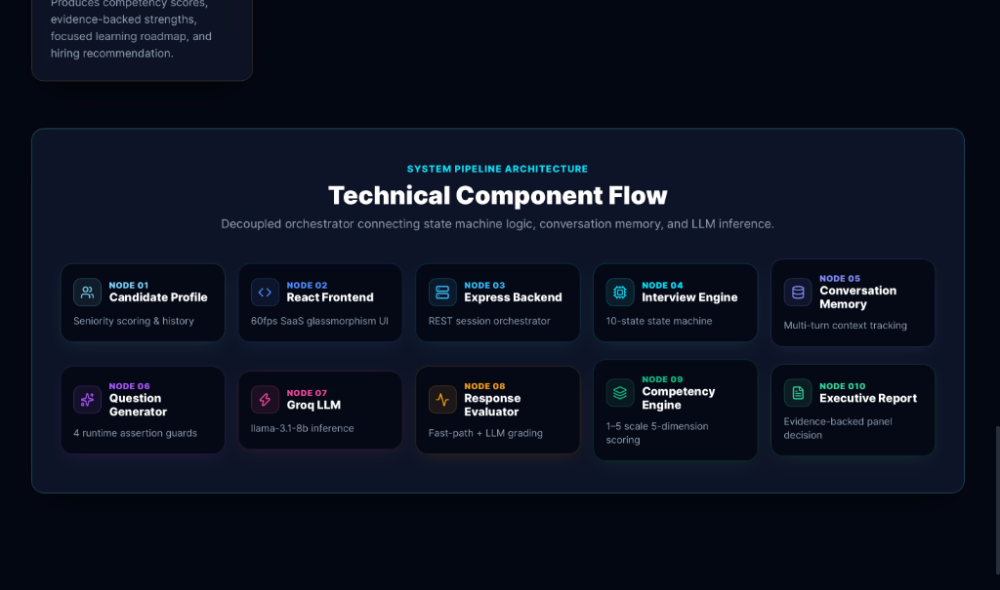
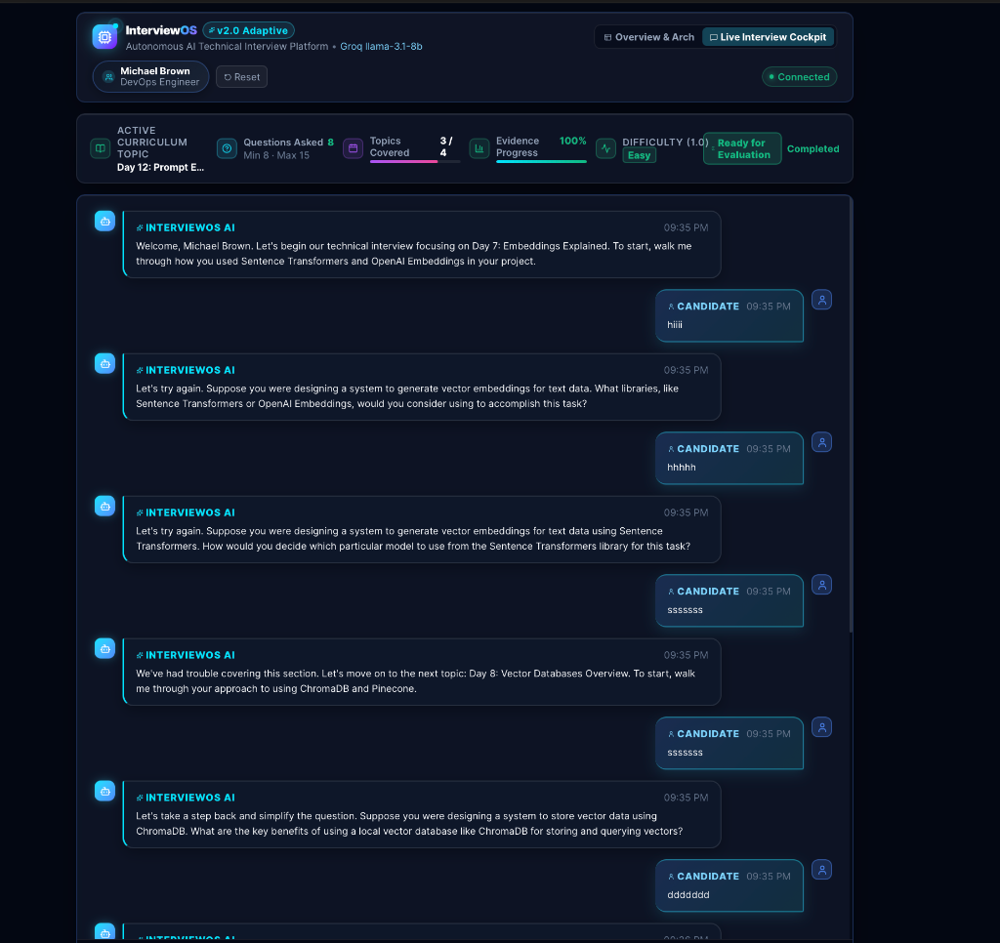
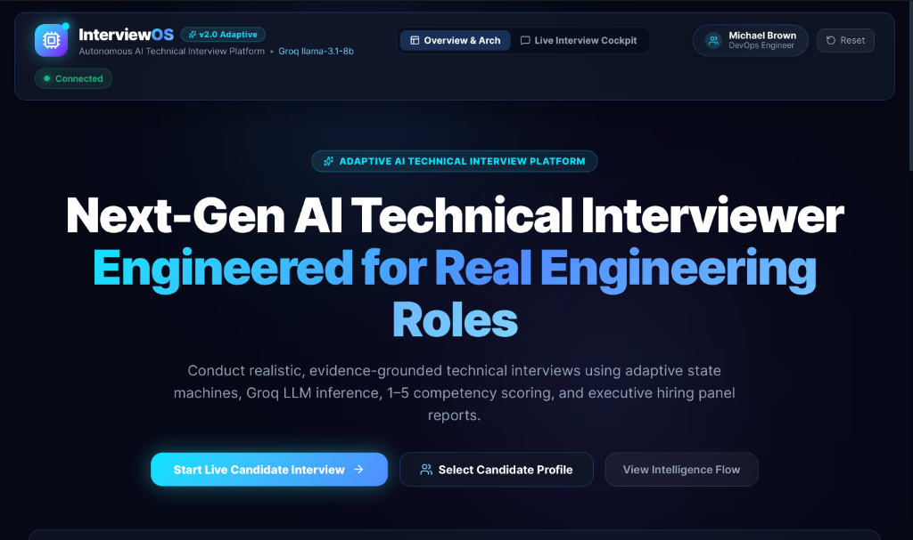
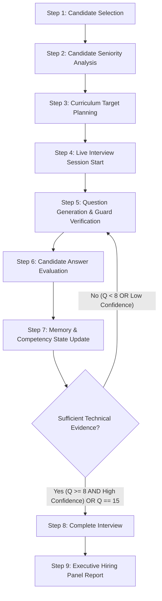
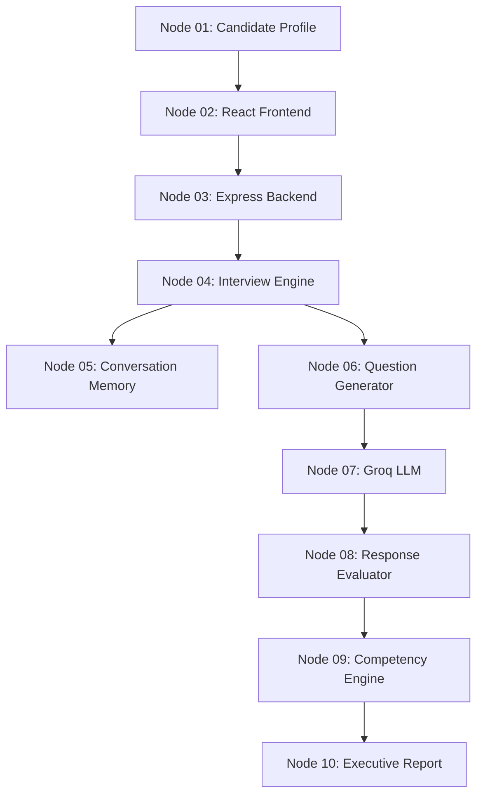

# InterviewOS — Autonomous Adaptive AI Technical Interview Platform

> **Next-Gen AI Technical Interviewer Engineered for Real Engineering Roles**  
> *Hackathon Edition — Autonomous, Evidence-Grounded, Curriculum-Aware*

[](https://groq.com)
[](https://react.dev)
[](https://www.typescriptlang.org)
[](LICENSE)

InterviewOS is an autonomous, adaptive AI Technical Interviewer engineered to evaluate candidate capabilities across a **31-Day AI Engineering Cohort**. Emulating principal engineering hiring managers at companies like OpenAI, Google, and Vercel, InterviewOS combines deterministic finite state machines, multi-turn conversation memory, runtime assertion guards, 1–5 evidence-based competency scoring, and executive hiring panel evaluation reports.

---

## 📸 Application Showcase

### 1. Landing Page & Executive Overview


### 2. Candidate Cohort Selector (20 Pre-loaded Engineering Profiles)


### 3. Interview Intelligence Flow & Reasoning Architecture


### 4. Core AI Intelligence Capabilities


### 5. Technical System Pipeline Component Flow


### 6. Live Interview Cockpit & Interactive Chat


### 7. Executive Hiring Panel Report & Competency Scorecard


---

## 🌟 Core AI Capabilities & Key Features

- 🎯 **Curriculum-Aware Technical Grounding**: Grounds every turn in a candidate's completed or skipped missions across a 31-day AI Engineering Cohort (Sentence Transformers, ChromaDB, RAG, LoRA Fine-Tuning, vLLM, Triton, MCP).
- 🧠 **Multi-Turn Conversation Memory**: Maintains context across turns, tracking visited topic days, asked objectives, detected mistakes, validated strengths, and candidate answers.
- ⚡ **Dynamic Evidence-Based Interview Length**:
  - **Minimum 8 Questions**: Satisfies the hackathon core requirement under all circumstances.
  - **Minimum 4 Curriculum Topics**: Ensures broad technical coverage across different days.
  - **Adaptive Extension (Up to 15 Questions)**: If candidate evidence is inconsistent, weak, or incomplete, the engine automatically asks additional probing questions up to a configurable 15-question cap.
  - **Evidence-Driven Termination**: The interview completes only after sufficient technical evidence is gathered to make a high-confidence hiring recommendation.
- 🔬 **Progressive Probing & Adaptive Questioning**: Follows real engineering interview patterns: basic concept awareness $\rightarrow$ practical implementation details $\rightarrow$ production trade-off analysis.
- 📊 **Evidence-Based Competency Scoring (1–5 Scale)**: Replaces simplistic keyword counting with structured evaluations across 5 core engineering dimensions:
  1. **Technical Understanding** (1.0–5.0)
  2. **Practical Implementation** (1.0–5.0)
  3. **Architecture & System Design** (1.0–5.0)
  4. **Trade-off Analysis** (1.0–5.0)
  5. **Communication Quality** (1.0–5.0)
- 🎛️ **Real-time Live Interview Cockpit**:
  - **Active Curriculum Topic**: Day X title & mission goals.
  - **Questions Asked**: Counter tracking `Min 8 · Max 15`.
  - **Topics Covered**: Curriculum day coverage meter (`X / 4`).
  - **Evidence Progress (%)**: Real-time evidence accumulation indicator.
  - **Adaptive Difficulty Meter**: Color-coded scalar (`Easy`, `Medium`, `Advanced`, `Expert`).
  - **Live Status Badge**: Transitions dynamically (`Collecting Evidence...` $\rightarrow$ `Final Validation...` $\rightarrow$ `Ready for Evaluation`).
- 🏆 **Executive Hiring Panel Report**:
  - **Overall Recommendation**: `Strong Hire`, `Hire`, `Lean Hire`, `Weak Pass`, `No Hire`.
  - **Evaluation Confidence**: `High`, `Medium`, `Low`.
  - **Verified Strengths**: Grouped competency statements backed by actual candidate proofs (max 3).
  - **Identified Gaps**: Concise technical weaknesses (max 5).
  - **Focused Growth Roadmap**: Actionable curriculum review objectives (max 3).
  - **Continuation Reasons**: Transparent explanation of why the interview extended past Question 8 (when applicable).

---

## 💡 Dynamic Interview Intelligence Flow

Unlike deterministic bots that ask a fixed number of static questions, InterviewOS operates as an evidence-driven reasoning engine:



### Interview Length Policy

| Parameter | Policy Constraint | Rationale |
| :--- | :--- | :--- |
| **Minimum Questions** | **8 Questions** | Enforces hackathon baseline requirement. Interview NEVER completes early. |
| **Minimum Topics** | **4 Curriculum Days** | Ensures broad candidate evaluation across separate cohort topics. |
| **Maximum Safety Cap** | **15 Questions** | Prevents infinite interview loops when candidate answers are ambiguous. |
| **Termination Criteria** | $Q \ge 8 \text{ AND } D \ge 4 \text{ AND Evidence Confident}$ | Terminates naturally when principal hiring manager has collected verified proofs. |

---

## 🏗️ Technical Pipeline Architecture

InterviewOS is built with a decoupled architecture separating UI state management, backend orchestration, finite state machines, and LLM inference.



### System Component Nodes

1. **Candidate Profile**: Evaluates 20 cohort profiles, computing seniority scores ($S \in [1.0, 5.0]$) and historical mission completion.
2. **React Frontend**: 60fps dark obsidian SaaS interface with Tailwind CSS, Glassmorphism backdrop filters, and Framer Motion animations.
3. **Express Backend**: REST session orchestrator managing turn state, memory persistence, and streaming API responses (`POST /api/interview`, `GET /api/candidates`, `GET /health`).
4. **Interview Engine**: Core stateful orchestrator governing turn transitions across a 10-state Finite State Machine.
5. **Conversation Memory**: Tracks visited days, asked objectives, detected mistakes, validated concepts, and sliding context windows.
6. **Question Generator**: Generates grounded interviewer questions enforcing 4 runtime assertion guards (topic grounding, no topic leakage, prompt diversity, follow-up phrase guard).
7. **Groq LLM**: Low-latency `llama-3.1-8b-instant` inference powering fast-path evaluation and question synthesis.
8. **Response Evaluator**: Classifies candidate answers (`EXCELLENT`, `GOOD`, `WEAK`, `UNCERTAIN`, `GIBBERISH`, `OFF_TOPIC`, `PROFANITY`) and detects concepts.
9. **Competency Engine**: Calculates evidence-weighted 1–5 scores across Technical, Implementation, Architecture, Trade-offs, and Communication.
10. **Executive Report Engine**: Compiles executive hiring panel decisions, star ratings, evidence proofs, missing concepts, and learning roadmaps.

---

## 🛠️ Tech Stack

- **Frontend**: React 19, Vite, TypeScript, Framer Motion, Lucide Icons, Glassmorphism CSS
- **Backend**: Node.js, Express, TypeScript, Groq SDK (`llama-3.1-8b-instant`)
- **Engine Architecture**: 10-state Finite State Machine, Stateful Conversation Memory, Curriculum Navigator
- **Styling & Theme**: Dark Obsidian (`#030712`), Deep Navy (`#0F172A`), Cyan (`#00E5FF`), Blue (`#4F8CFF`), Emerald (`#10B981`)

---

## 🚀 Quick Start Guide

### Prerequisites
- **Node.js**: `v18.0.0` or higher
- **npm**: `v9.0.0` or higher

### 1. Start Express Backend API Server
```bash
cd backend
npm install
npm run build
npm start
```
*Backend server starts at `http://localhost:5001`*

### 2. Start React Frontend Cockpit
```bash
cd frontend
npm install
npm run dev
```
*Frontend application starts at `http://localhost:5173`*

---

## 🧪 Running Automated Test Suites

```bash
cd backend

# 1. Test Candidate & Curriculum Dataset Loaders
npm run test:phase1

# 2. Test Express Server, Health Check & Session Store
npm run test:phase2

# 3. Test Deterministic Brain & State Machine
npm run test:brain

# 4. Test Orchestration Layer & Turn Transitions
npm run test:orchestrator

# 5. Full End-to-End Multi-Turn Interview & Executive Report Generation
npm run test:e2e
```

---

## 🎯 Hackathon Presentation Demo Flow (30-Second Judge Tour)

1. **Landing Overview**: Present the Hero section, Animated Interview Journey Timeline, Interview Intelligence Flow, and Core AI Capabilities.
2. **Candidate Selection**: Open the Candidate Selector Drawer (`Press Esc`) and select any of the 20 cohort profiles (e.g., *Sarah Johnson*, *Harold Whitfield*, *Ethan Brooks*).
3. **Live Technical Interview**:
   - Submit technical answers via the floating chat composer.
   - Observe real-time cockpit meters update (Questions counter, Topics Covered meter, Evidence Progress %, Adaptive Difficulty, Interview Status badge).
   - Observe progressive follow-up probing on good answers (`concept` $\rightarrow$ `implementation` $\rightarrow$ `trade-offs`).
4. **Executive Hiring Panel Report**: Complete the interview and inspect the Executive Hiring Panel Report, displaying 1–5 competency scorecards, star ratings, evidence-backed strengths, identified gaps, and panel recommendation.

---

## 📚 Development Documentation

The complete prompt engineering journey is documented in [`PROMPTS.md`](PROMPTS.md), providing a chronological record of the iterative development process behind InterviewOS.

---

<p align="center">
  <b>InterviewOS</b> — Engineered for the AI Engineering Cohort Hackathon.
</p>
